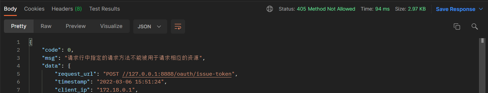
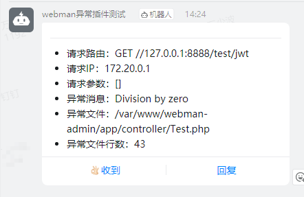

# webman exception handler 异常插件

[](https://packagist.org/packages/tinywan/exception-handler)
[](https://packagist.org/packages/tinywan/exception-handler)
[](https://packagist.org/packages/tinywan/exception-handler)
[](https://packagist.org/packages/tinywan/exception-handler)
[](https://packagist.org/packages/tinywan/exception-handler)
[]()
[]()

## 安装

```php
composer require tinywan/exception-handler
```

## 配置

`config/exception.php`

```php
return [
    // 这里配置异常处理类
    '' => \Tinywan\ExceptionHandler\Handler::class,
];
```
> 多应用模式时，你可以为每个应用单独配置异常处理类，参见[多应用](https://www.workerman.net/doc/webman/multiapp.html)

## 基本用法

请求参数错误
```php
use support\Request;
use support\Response;
use Tinywan\ExceptionHandler\Exception\BadRequestHttpException;

class Token{
    public function issueToken(Request $request): Response
    {
        $params = $request->post();
        if (empty($params)) {
            throw new BadRequestHttpException('账号或密码不能为空');
        }
    }
}
```
以上异常抛出错误信息，如下格式：
```json
HTTP/1.1 400 Bad Request
Content-Type: application/json;charset=utf-8

{
    "code": 0,
    "msg": "账号或密码不能为空",
    "data": {},
}
```
> 所有返回的异常信息将以json格式返回，以上为`返回简略的异常信息`

所有的异常错误处理器根据配置文件 `config/app.php`中`debug`的值来调整错误显示， 当`debug`值为`true` (表示在调试模式)， 错误处理器会显示异常以及详细的函数调用栈和源代码行数来帮助调试，将返回详细的异常信息。 当`debug`值为`false`，只有错误信息会被显示以防止应用的敏感信息泄漏，将返回简略的异常信息。

返回详细的异常信息
```json
HTTP/1.1 400 Bad Request
Content-Type: application/json;charset=utf-8
        
{
    "code": 0,
    "msg": "password不允许为空",
    "data": {
        "request_url": "POST //127.0.0.1:8888/oauth/issue-token",
        "timestamp": "2022-03-06 15:19:12",
        "client_ip": "172.18.0.1",
        "request_param": {
            "username": "webman"
        },
        "error_message": "password不允许为空",
        "error_trace": "#0 /var/www/webman-admin/app/functions.php(68): Tinywan\\Validate\\Validate->check(Array)\n#1 /var/www/webman-admin/app/controller/Authentication.php(25): validate(Array, 'app\\\\common\\\\vali...')\n#2 /var/www/webman-admin/vendor/workerman/webman-framework/src/App.php(234): app\\controller\\Authentication->issueToken(Object(support\\Request))\n#3 /var/www/webman-admin/app/middleware/AccessControlMiddleware.php(26): Webman\\App::Webman\\{closure}(Object(support\\Request))\n#4 /var/www/webman-admin/vendor/workerman/webman-framework/src/App.php(228): app\\middleware\\AccessControlMiddleware->process(Object(support\\Request), Object(Closure))\n#5 /var/www/webman-admin/vendor/workerman/webman-framework/src/App.php(137): Webman\\App::Webman\\{closure}(Object(support\\Request))\n#6 /var/www/webman-admin/vendor/workerman/workerman/Connection/TcpConnection.php(638): Webman\\App->onMessage(Object(Workerman\\Connection\\TcpConnection), Object(support\\Request))\n#7 /var/www/webman-admin/vendor/workerman/workerman/Events/Select.php(295): Workerman\\Connection\\TcpConnection->baseRead(Resource id #254)\n#8 /var/www/webman-admin/vendor/workerman/workerman/Worker.php(2417): Workerman\\Events\\Select->loop()\n#9 /var/www/webman-admin/vendor/workerman/workerman/Worker.php(1541): Workerman\\Worker->run()\n#10 /var/www/webman-admin/vendor/workerman/workerman/Worker.php(1383): Workerman\\Worker::forkOneWorkerForLinux(Object(Workerman\\Worker))\n#11 /var/www/webman-admin/vendor/workerman/workerman/Worker.php(1357): Workerman\\Worker::forkWorkersForLinux()\n#12 /var/www/webman-admin/vendor/workerman/workerman/Worker.php(549): Workerman\\Worker::forkWorkers()\n#13 /var/www/webman-admin/start.php(87): Workerman\\Worker::runAll()\n#14 {main}"
    }
}
```
增加异常扩展响应数据
```php
throw new BadRequestHttpException('验证码错误',[
    'data' => [
        'data1' => '自定义响应数据1',
        'data2' => '自定义响应数据2',
    ]
]);
```
> 将会在响应的 `data` 增加自义定的扩展响应参数

增加`data`的返回详细的异常信息
```json
{
    "code": 0,
    "msg": "验证码错误",
    "data": {
        "request_url": "POST //127.0.0.1:8888/oauth/issue-token",
         ...
        "data1": "自定义响应数据1",
        "data2": "自定义响应数据2"
    }
}
```

## 如何自定义一个自己的异常类

### 编写异常类

假设自定义一个：`405 Method Not Allowed`（表示：请求行中指定的请求方法不能被用于请求相应的资源）

自定义异常类只需要继承`Tinywan\ExceptionHandler\Exception\BaseException`类即可

```php
<?php
declare(strict_types=1);

namespace support\exception;

use Tinywan\ExceptionHandler\Exception\BaseException;

class MethodNotAllowedException extends BaseException
{
    /**
     * @var int
     */
    public int $statusCode = 405;

    /**
     * @var string
     */
    public string $errorMessage = '请求行中指定的请求方法不能被用于请求相应的资源';
}
```

### 使用异常类

```php
use support\Request;
use support\Response;
use support\exception\MethodNotAllowedException;

class Token{
    public function issueToken(Request $request): Response
    {
        $params = $request->post();
        if (empty($params)) {
            throw new MethodNotAllowedException();
        }
    }
}
```

使用postman请求截图



## 已支持插件异常类

- [Validate 验证器插件](https://www.workerman.net/plugin/7) 异常类`JwtTokenException`
- [JWT 权限认证插件](https://www.workerman.net/plugin/10) 异常类`ValidateException`

## 内置异常类

- 客户端异常类（HTTP Status 400）：BadRequestHttpException
- 身份认证异常类（HTTP Status 401）：UnauthorizedHttpException
- 资源授权异常类（HTTP Status 403）：ForbiddenHttpException
- 资源不存在异常类（HTTP Status 404）：NotFoundHttpException
- 路由地址不存在异常类（HTTP Status 404）：RouteNotFoundException
- 请求限流在异常类（HTTP Status 429）：TooManyRequestsHttpException
- 服务器内部错误异常类（HTTP Status 500）：ServerErrorHttpException

[更多：https://developer.mozilla.org/zh-CN/docs/Web/HTTP/Status](https://developer.mozilla.org/zh-CN/docs/Web/HTTP/Status)

## 自定义异常 Response

> 使用场景
- 每个项目有标准的统一输出，自定义返回内容
- 前后端分离：前端要求返回的 `HTTP状态码`并不是 `429`，而是 `200` 或者其他
- 响应的`body`不是 `{"code":0,"msg":"Too Many Requests"}`，而是 `{"error_code":200,"message":"Too Many Requests"}` 等其他内容

### 自定义HTTP状态码

编辑 `config/plugin/tinywan/exception-handler/app.php` 文件的 `status` HTTP 状态码

### 自定义`body`返回内容

编辑 `config/plugin/tinywan/exception-handler/app.php` 文件的 `body` 的字段

**默认选项是**

```json
{
	"code": 0,
	"msg": "Too Many Requests",
	"data": null
}
```
**自定义选项参考一**

1、假设`status` HTTP 状态码设置为 `200`

2、假设`body`的数组设为为

```php
'body' => [
	'error_code' => 200,
	'message' => '请求太多请稍后重试'
]
```

则响应内容为
```json
HTTP/1.1 200 OK
Content-Type: application/json;charset=UTF-8

{
	"error_code": 200,
	"message": "请求太多请稍后重试"
}
```
其他的可以根据自身业务自定义即可

## 扩展自己的 Handler

当项目需要自定义情况比较多的时候，很可能需要扩展 Handler，此时可以继承 `Tinywan\ExceptionHandler\Handler` 然后修改对应方法即可。

> 使用场景
- response需要响应`xml`，而不是json格式，只需要覆盖`buildResponse`方法
- 扩展其他Exception的响应，我只要覆盖`solveExtraException`
- 要异常推送微信消息，我可以覆盖`triggerNotifyEvent`

自定义异常 `ErrorHandler`

```php

namespace support;

use Illuminate\Validation\ValidationException;
use Tinywan\ExceptionHandler\Handler;
use Webman\Http\Response;

class ErrorHandler extends Handler
{
    /**
     * @inheritDoc
     */
    protected function solveExtraException(\Throwable $e): void
    {
        // 当前项目下的异常扩展
        if ($e instanceof ValidationException) {
            $this->errorMessage = $e->validator->errors()->first();
            $this->errorCode = 422;
            return;
        }

        parent::solveExtraException($e);
    }

    /**
     * @inheritDoc
     */
    protected function triggerNotifyEvent(\Throwable $e): void
    {
         // ... 这里省略触发其他错误推送渠道

        parent::triggerNotifyEvent($e);
    }

    /**
     * @inheritDoc
     */
    protected function buildResponse(): Response
    {
        // 构造自己项目下的响应
        return json([
            'code' => $this->statusCode, // 使用 statusCode 作为 code 返回
            'msg' => $this->errorMessage,
            'data' => $this->responseData,
        ]);
    }
}
```

## 异常通知（钉钉机器人）



## Other

### phpstan

```phpregexp
vendor/bin/phpstan analyse src
```

### vendor/bin/php-cs-fixer fix src

```phpregexp
vendor/bin/php-cs-fixer fix src
```
